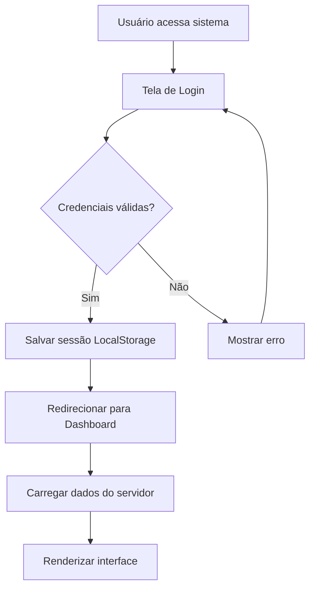
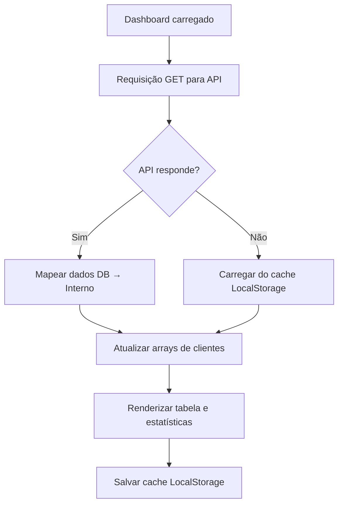
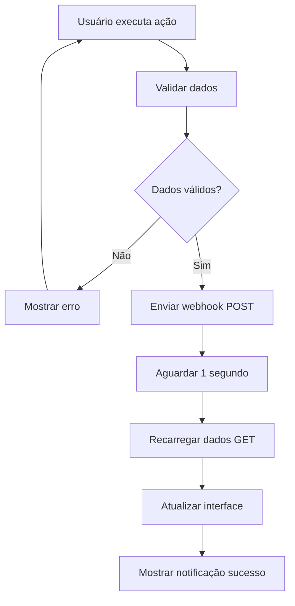
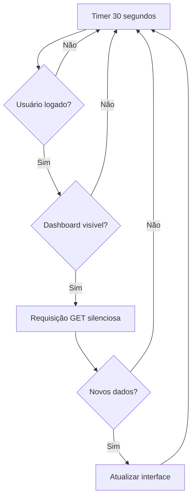

# 🔧 Documentação Técnica - Ganfi Admin

## 📋 **Índice**
1. [Arquitetura do Sistema](#arquitetura)
2. [APIs e Endpoints](#apis)
3. [Estrutura de Dados](#dados)
4. [Fluxos de Funcionamento](#fluxos)
5. [Configurações](#config)
6. [Troubleshooting](#troubleshooting)

---

## 🏗️ **Arquitetura do Sistema** {#arquitetura}

### **Frontend (Client-Side)**
```
┌─────────────────────────────────────┐
│           INTERFACE WEB             │
├─────────────────────────────────────┤
│  • HTML5 (Estrutura)               │
│  • CSS3 (Estilos + Responsivo)     │
│  • JavaScript ES6+ (Lógica)        │
│  • Font Awesome (Ícones)           │
└─────────────────────────────────────┘
                    │
                    ▼
┌─────────────────────────────────────┐
│        CAMADA DE DADOS              │
├─────────────────────────────────────┤
│  • LocalStorage (Cache)             │
│  • Fetch API (HTTP Requests)       │
│  • Event Listeners (Interação)     │
└─────────────────────────────────────┘
```

### **Backend Integration**
```
┌─────────────────────────────────────┐
│          WEBHOOK ENDPOINTS          │
├─────────────────────────────────────┤
│  • GET: Buscar clientes             │
│  • POST: Sincronizar operações      │
└─────────────────────────────────────┘
                    │
                    ▼
┌─────────────────────────────────────┐
│         BANCO DE DADOS              │
├─────────────────────────────────────┤
│  • Tabela de clientes               │
│  • Números autorizados              │
│  • Status de pagamento              │
└─────────────────────────────────────┘
```

---

## 🌐 **APIs e Endpoints** {#apis}

### **1. Endpoint de Leitura (GET)**
```
URL: https://requisicao.grupoganfi.com/webhook/0f8b0045-4bc7-40e0-b902-bd7d2d6c26cf
Método: GET
Content-Type: application/json
User-Agent: Ganfi-Admin/1.0
```

**Response Esperado:**
```json
[
  {
    "id_contato": 11,
    "nome": "Nome do Cliente",
    "numero_telefone": null,
    "email": null,
    "data_qualificacao": null,
    "data_criacao": "2025-09-25T15:27:30.997Z",
    "cpf": null,
    "status": "paid",
    "numeros_autorizados": [
      "(15) 99171-6525"
    ]
  }
]
```

### **2. Endpoint de Escrita (POST)**
```
URL: https://requisicao.grupoganfi.com/webhook/50e63045-e679-4ad3-b496-a6700f4c9917
Método: POST
Content-Type: application/json
User-Agent: Ganfi-Admin/1.0
```

**Payload Enviado:**
```json
{
  "evento": "novo_cliente" | "cliente_atualizado" | "cliente_excluido",
  "cliente": {
    "id": 123456789,
    "nome": "Nome do Cliente",
    "numerosAutorizados": ["5511999999999"],
    "statusPagamento": "paid" | "pending" | "overdue",
    "diaVencimento": 15,
    "criadoEm": "2025-09-25T10:30:00.000Z",
    "atualizadoEm": "2025-09-25T10:30:00.000Z"
  },
  "timestamp": "2025-09-25T10:30:00.000Z",
  "origem": "ganfi-admin-web"
}
```

**⚠️ Importante**: Os números são convertidos automaticamente de `(11) 99999-9999` para `5511999999999` (DDI 55 + DDD + número) antes do envio.

---

## 📊 **Estrutura de Dados** {#dados}

### **Formato Interno (JavaScript)**
```javascript
const cliente = {
  id: Number,                    // ID único do cliente
  name: String,                  // Nome completo
  authorizedNumbers: Array,      // ["(11) 99999-9999"]
  paymentStatus: String,         // "paid" | "pending" | "overdue"
  dueDay: Number,               // 1-31 (dia do vencimento)
  createdAt: String,            // ISO Date
  updatedAt: String             // ISO Date (opcional)
};
```

### **Formato do Banco de Dados**
```javascript
const clienteDB = {
  id_contato: Number,
  nome: String,
  numero_telefone: String | null,
  email: String | null,
  data_qualificacao: String | null,
  data_criacao: String,         // ISO Date
  cpf: String | null,
  status: String,               // "paid" | "pending" | "overdue"
  numeros_autorizados: Array    // ["(15) 99171-6525"]
};
```

### **Mapeamento de Dados**
```javascript
// Conversão DB → Interno
function mapDbToInternal(clienteDB) {
  return {
    id: clienteDB.id_contato,
    name: clienteDB.nome,
    authorizedNumbers: clienteDB.numeros_autorizados || [],
    paymentStatus: clienteDB.status,
    dueDay: extractDayFromDate(clienteDB.data_criacao) || 15,
    createdAt: clienteDB.data_criacao,
    updatedAt: clienteDB.data_qualificacao
  };
}
```

---

## 🔄 **Fluxos de Funcionamento** {#fluxos}

### **1. Fluxo de Login**


### **2. Fluxo de Carregamento de Dados**


### **3. Fluxo de Operações CRUD**


### **4. Fluxo de Auto-Refresh**


---

## ⚙️ **Configurações** {#config}

### **Configurações Principais**
```javascript
const CONFIG = {
  adminEmail: 'adminganfi@gmail.com',
  adminPassword: 'ganfiadmin*',
  storageKey: 'ganfi_clients_data',
  
  // URLs das APIs
  readEndpoint: 'https://requisicao.grupoganfi.com/webhook/0f8b0045-4bc7-40e0-b902-bd7d2d6c26cf',
  writeEndpoint: 'https://requisicao.grupoganfi.com/webhook/50e63045-e679-4ad3-b496-a6700f4c9917',
  
  // Timers
  autoRefreshInterval: 30000,     // 30 segundos
  reloadDelay: 1000,              // 1 segundo após operações
  notificationDuration: 3000,     // 3 segundos
  
  // Headers HTTP
  userAgent: 'Ganfi-Admin/1.0',
  contentType: 'application/json'
};
```

### **Elementos DOM**
```javascript
const elements = {
  // Telas principais
  loginScreen: document.getElementById('loginScreen'),
  dashboard: document.getElementById('dashboard'),
  
  // Formulários
  loginForm: document.getElementById('loginForm'),
  clientForm: document.getElementById('clientForm'),
  
  // Inputs
  searchClients: document.getElementById('searchClients'),
  clientName: document.getElementById('clientName'),
  paymentStatus: document.getElementById('paymentStatus'),
  dueDay: document.getElementById('dueDay'),
  
  // Botões
  addClientBtn: document.getElementById('addClientBtn'),
  refreshDataBtn: document.getElementById('refreshDataBtn'),
  logoutBtn: document.getElementById('logoutBtn'),
  
  // Modais
  clientModal: document.getElementById('clientModal'),
  confirmModal: document.getElementById('confirmModal'),
  
  // Containers
  numbersContainer: document.querySelector('.numbers-container'),
  clientsTableBody: document.getElementById('clientsTableBody')
};
```

---

## 🛠️ **Troubleshooting** {#troubleshooting}

### **Problemas Comuns**

#### **1. API não responde**
```javascript
// Sintomas: "Erro ao carregar clientes do servidor"
// Solução: Sistema usa cache local automaticamente
// Debug: Verificar console para detalhes do erro
```

#### **2. Dados não sincronizam**
```javascript
// Sintomas: Mudanças não aparecem após operações
// Possível causa: Webhook POST falhou
// Solução: Clicar em "Atualizar" manualmente
// Debug: Verificar Network tab no DevTools
```

#### **3. Login não funciona**
```javascript
// Sintomas: "Email ou senha incorretos"
// Verificar: adminganfi@gmail.com / ganfiadmin*
// Solução: Conferir credenciais exatas
```

#### **4. Interface quebrada**
```javascript
// Sintomas: Layout desarranjado
// Possível causa: CSS não carregou
// Solução: Recarregar página (Ctrl+F5)
```

### **Logs Úteis**
```javascript
// Console logs para debug:
console.log('Cliente carregados:', clients.length);
console.log('Webhook enviado:', evento, clientData.name);
console.error('Erro na API:', error);
```

### **Comandos de Debug**
```javascript
// No console do navegador:

// Ver dados atuais
console.log(clients);

// Forçar reload de dados
refreshClientsFromServer();

// Limpar cache
localStorage.removeItem('ganfi_clients_data');

// Ver configuração
console.log(CONFIG);
```

### **Verificações de Saúde**

#### **1. Status da API**
```bash
# Testar endpoint GET
curl -X GET "https://requisicao.grupoganfi.com/webhook/0f8b0045-4bc7-40e0-b902-bd7d2d6c26cf"

# Testar endpoint POST
curl -X POST "https://requisicao.grupoganfi.com/webhook/50e63045-e679-4ad3-b496-a6700f4c9917" \
  -H "Content-Type: application/json" \
  -d '{"evento":"teste","cliente":{}}'
```

#### **2. Validar LocalStorage**
```javascript
// Verificar dados salvos
const stored = localStorage.getItem('ganfi_clients_data');
console.log('Cache local:', JSON.parse(stored));

// Verificar sessão
const session = localStorage.getItem('ganfi_logged_user');
console.log('Sessão ativa:', !!session);
```

#### **3. Verificar Performance**
```javascript
// Monitorar timers
console.log('Auto-refresh ativo:', !!autoRefreshTimer);

// Verificar event listeners
console.log('Botões conectados:', {
  addClient: !!elements.addClientBtn,
  refresh: !!elements.refreshDataBtn,
  logout: !!elements.logoutBtn
});
```

---

## 📚 **Referências Técnicas**

### **APIs Utilizadas**
- **Fetch API**: Requisições HTTP modernas
- **LocalStorage API**: Persistência local
- **DOM API**: Manipulação da interface
- **Date API**: Manipulação de datas

### **Padrões Seguidos**
- **ES6+ Modules**: Código modular
- **Async/Await**: Programação assíncrona
- **Event-Driven**: Arquitetura baseada em eventos
- **Progressive Enhancement**: Funciona sem JavaScript básico

### **Compatibilidade**
- **Chrome**: 60+
- **Firefox**: 55+
- **Safari**: 11+
- **Edge**: 79+

---

*Documentação técnica do sistema Ganfi Admin v1.0.0*